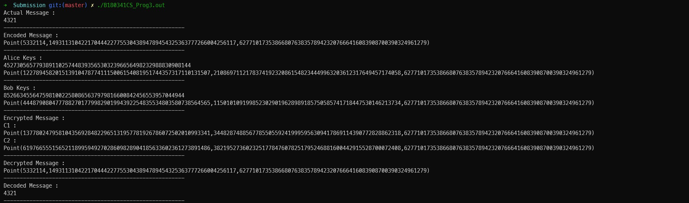
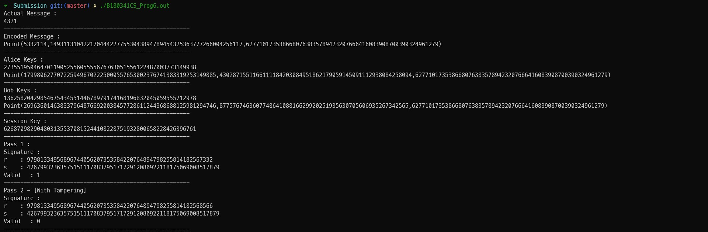

Q1 : Implementation of RSA using 512 bit and 1024 bit parameters

```c++
+++,B180341CS_Prog1.cpp
```
Output : 


Q2 : Implementation of ElGamal using 512 bit and 1024 bit parameters

```c++
+++,B180341CS_Prog2.cpp
```
Output : 


Q3 : Implementation of ECC using F-192 parameters

```c++
+++,B180341CS_Prog3.cpp
```
Output : 


Q4 - a : Digital Signature Implementation using RSA

Header Files with Necessary Utils for SHA Hash

```c++
+++,B180341CS_Prog4.cpp
```
Output : 


Q4 - b : Digital Signature Implementation using ElGamal

```c++
+++,B180341CS_Prog5.cpp
```
Output : 


Q4 - c : Digital Signature Implementation using ECC 

```c++
+++,B180341CS_Prog6.cpp
```
Output : 
